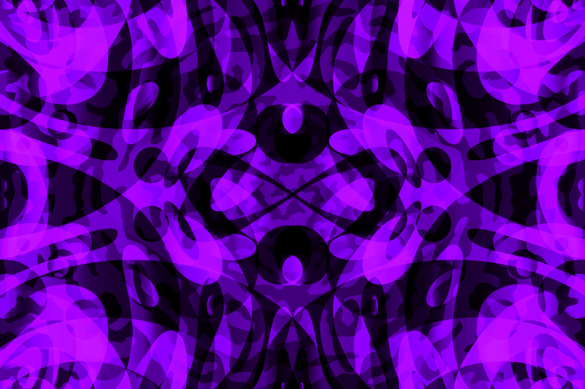

# Nam's stuff

This is a site for me to present stuff I made.

Hello! My name is **Nam**, nickname **Ethereal**, a Vietnamese who's in love with **Art** and **Music**.

## Art?

I have been **drawing** since I was around **four years old**, so it's not a coincidence that I would choose the **Graphic Design** path as my **dream career**.
I believe my art are "awesome" or at least eye-catching to some extend.

For example, my own **icon** and **banner** designs:

    

    

> You can see **more** at my **art & photography** gallery **profile**. [Visit my profile on cara.app](https://cara.app/namchill235)

## What about Music?

Just few years later, around the time when I was **6** ~ **7** years old, I started playing **piano**, unwillingly.
But I could not be less thankful that my mother did not give up on encouraging me to learn it, or else I wouldn't be who I am today.

For example, this is the **first ever piano song** I wrote and recorded when I was **twelve years old**.

    

> Just like the **cycle of life**: one thing must end before another can begin - **sunset**. [Listen on YouTube](https://www.youtube.com/watch?v=Hdk7zulaCC4)
