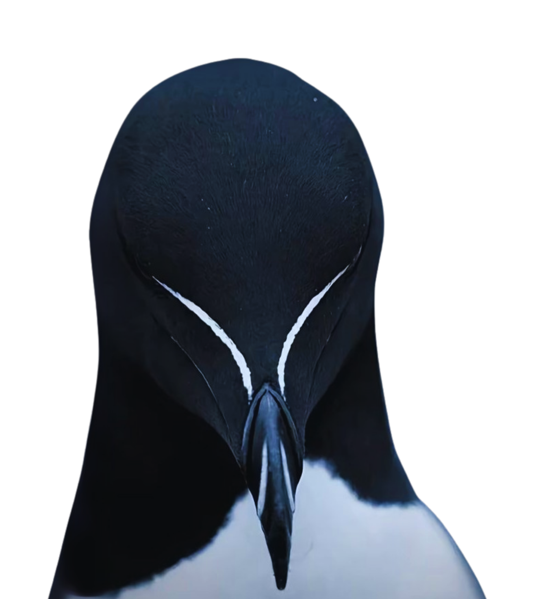
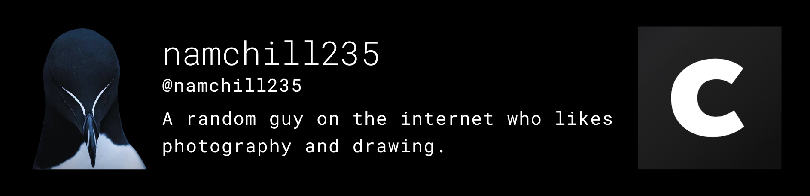
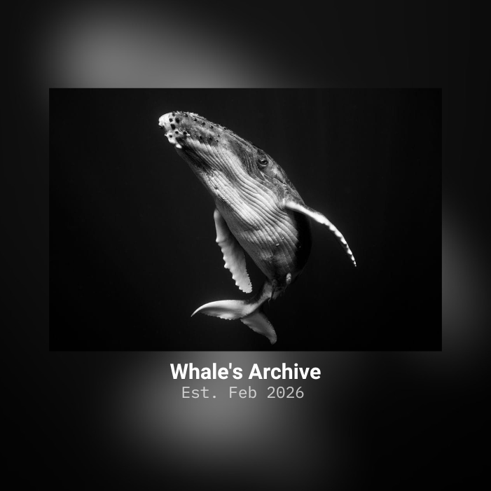
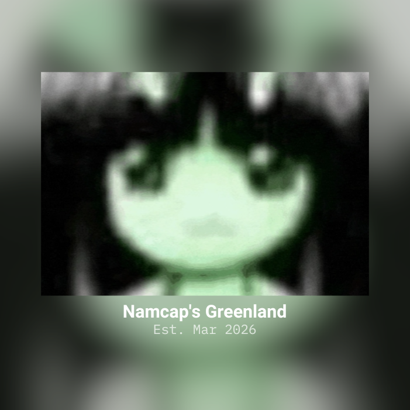

    

# namchill235
Hi. My name is Nam, and I am a musician; I write, compose, and produce my own music.
My side hobbies include drawing, venturing in the nature, and explore the tech world.

## Projects

### Music

- #### Home

  

> The feeling of loss when the distance of what used to be safe and warm grows - home. [Listen on YouTube](https://www.youtube.com/watch?v=zt2kS3zKKvQ)

- #### Sunset

  

> Just like the cycle of life: one thing must end before another can begin - sunset. [Listen on YouTube](https://www.youtube.com/watch?v=Hdk7zulaCC4)

### Film

- #### Winter Leaf

  

> A film about a young woman’s journey to overcome the pain of losing a loved one and to fight off the “Death's” invitations. [Watch on YouTube](https://www.youtube.com/watch?v=3NZ7WlffkWY)

### Photography & Visual Artworks

- #### Cara Portfolio

  

> Most of my photographs and drawings are posted on Cara. [Visit My Cara Portfolio](https://cara.app/namchill235/portfolio "https://cara.app/namchill235/portfolio")

### Tech

- #### FEARLESS (Discord bot)

  

> [Visit GitHub Repository](https://github.com/NamTheDev/FEARLESS "https://github.com/NamTheDev/Green")

- #### GreenBot (Discord bot)

  

> [Visit GitHub Repository](https://github.com/NamTheDev/Green "https://github.com/NamTheDev/Green")

### Communities

- #### Whale's Archive

  

> A Discord community for sharing art, technology, game, and humor. [Join our Discord Server](https://discord.gg/7FWmpwKhq4)

- #### Namcap's Greenland (NCGL)

  

> A Discord apply-to-join community for NCGL Minecraft server. [Join our Discord Server](https://discord.gg/Z6GNTh7W5c)
